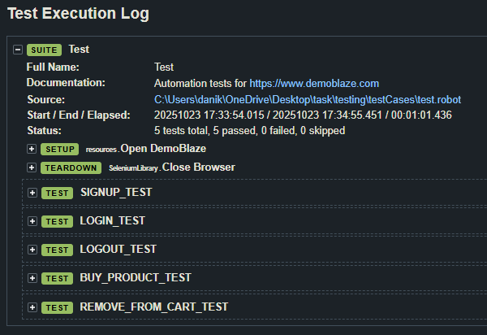

# DemoBlaze Automation Testing with BrowserStack



**Website:** [https://www.demoblaze.com](https://www.demoblaze.com)  
**Test Cases Description:** [test.txt](./test.txt)

This project automates 5 test cases for the DemoBlaze website using **Robot Framework** and **BrowserStack** for cross-browser testing.

---

## Test Cases

1. **SIGNUP_TEST** – Register a new user  
2. **LOGIN_TEST** – Log in with an existing user  
3. **LOGOUT_TEST** – Log out from the account  
4. **BUY_PRODUCT_TEST** – Add a product to the cart and complete purchase  
5. **REMOVE_FROM_CART_TEST** – Delete a product from the cart  

---

## Browser Coverage (BrowserStack)

- **Chrome** 
- **Firefox** 
- **Safari** 

All tests run on **BrowserStack** cloud infrastructure.

---

## Running Tests with BrowserStack

### Run All Browsers

```bash
robot --outputdir results/chrome testcases/chrome.robot
robot --outputdir results/firefox testcases/firefox.robot
robot --outputdir results/safari testcases/safari.robot
```

### Run Single Browser

```bash
robot testcases/chrome.robot

robot testcases/firefox.robot

robot testcases/safari.robot
```

### Run Specific Test Case

```bash
robot --test "Chrome - LOGIN_TEST" testcases/chrome.robot
```

---
### Run all tests locally `python main.py` 
### Run a specific test case: `robot --test NAME_TEST_CASE testCases/test.robot`